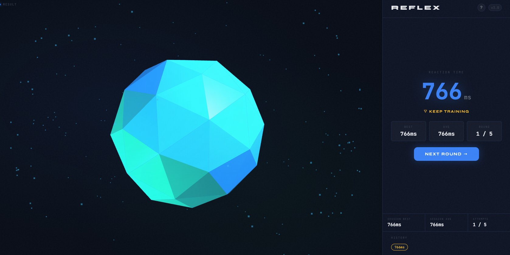

# REFLEX — Reaction Timer

A precision reaction time game built with vanilla JavaScript and Three.js. Test the speed of your nervous system across 5 rounds and see how you stack up against pro gamers and world records.

---

## Demo



---

## Features

- **3D Visual Engine** — Animated icosahedron, orbiting rings, and particle cloud powered by Three.js, reacting to each game state in real time
- **Precision Timing** — Millisecond-accurate reaction measurement using `performance.now()`
- **5-Round Sessions** — Play through 5 rounds then receive a full session summary with overall performance rating
- **False Start Detection** — Clicking before the GO signal counts as a false start and resets the round
- **Session Statistics** — Live best time, average, and round counter tracked throughout the session
- **Sound Effects** — Web Audio API sound design with unique tones for each game event (no external files)
- **Instructions Modal** — Full how-to-play guide with ratings breakdown, shown on first load and accessible via the `?` button
- **Keyboard Support** — Full game control via `SPACE` bar
- **Responsive Design** — Works on desktop and mobile
- **Zero Dependencies** — No build tools, no npm, no frameworks — just open `index.html`

---

## Project Structure

```
reflex/
├── index.html        # HTML structure and game state blocks
├── style.css         # All styles, animations, and theme variables
├── three-scene.js    # Three.js 3D scene module (icosahedron, rings, particles)
├── script.js         # Game logic, state machine, audio engine, stats
└── favicon.png       # Browser tab icon
```

---

## How to Run

### Option 1 — VS Code Live Server (recommended)
1. Open the project folder in VS Code
2. Install the **Live Server** extension if you haven't already
3. Right-click `index.html` → **Open with Live Server**

### Option 2 — Any local server
```bash
# Python
python3 -m http.server 8080

# Node.js
npx serve .
```

Then open `http://localhost:8080` in your browser.

> ⚠️ Do **not** open `index.html` directly via `file://` — browsers block certain JS features without a local server.

---

## How to Play

| Step | Action |
|------|--------|
| 1 | Click **INITIALIZE TEST** or press `SPACE` |
| 2 | Wait for the green **GO!** signal (1–5 second random delay) |
| 3 | Click **CLICK NOW** or press `SPACE` as fast as possible |
| 4 | See your reaction time and rating |
| 5 | Click **NEXT ROUND →** to continue — after 5 rounds, view your full session summary |

---

## Performance Ratings

| Rating | Time | Benchmark |
|--------|------|-----------|
| ⚡ SUPERHUMAN | < 130ms | Theoretical human limit |
| 🔥 LEGENDARY | 130–169ms | Elite competitive gamer |
| ✦ ELITE | 170–219ms | Top 5% of all humans |
| ◆ EXCELLENT | 220–269ms | Well above average |
| ◇ ABOVE AVERAGE | 270–329ms | Better than most |
| ▷ AVERAGE | 330–419ms | Typical human response |
| ▽ KEEP TRAINING | 420ms+ | Room to improve |

> Human average: ~250ms · Pro gamer: ~150ms · World record: ~100ms

---

## Tech Stack

| Technology | Usage |
|------------|-------|
| Vanilla JavaScript (ES6+) | Game logic, state machine, audio |
| Three.js r128 | 3D scene rendering |
| Web Audio API | Procedural sound effects |
| CSS3 | Animations, transitions, layout |
| Google Fonts | Syne + JetBrains Mono typography |

---

## Design

- **Color Palette** — Deep navy background (`#080D17`) with blue, green, amber, and red state accents
- **Typography** — Syne (display) + JetBrains Mono (data/UI)
- **3D States** — The scene color lerps smoothly between blue (idle), amber (waiting), green (GO), and red (false start)
- **Noise Texture** — Subtle SVG grain overlay for depth

---

## Game Architecture

The game runs on a finite state machine with 6 states:

```
IDLE → WAITING → READY → RESULT → (repeat 5x) → GAME_OVER
                    ↓
                TOO_SOON → back to IDLE
```

All state transitions are handled by `transitionTo()` in `script.js`, which updates the DOM, the indicator dot, and notifies the Three.js scene.

---

## License

MIT — free to use, modify, and distribute.

---

*Built as a portfolio project demonstrating vanilla JS, 3D web graphics, game state management, and UI/UX design.*
